# AquaNexus-BackEnd: Fish Catch Data Portal Backend

The **AquaNexus** project is a full-stack web application for **managing and analyzing georeferenced fish catch data**. This repository specifically contains the comprehensive backend services necessary for scalable data ingestion, storage, advanced analytics, and machine learning-powered insights.

<div align="center">


</div>

## Features

  * **REST APIs for Data Management:** Robust endpoints for fish catch data upload, querying, and retrieval.
  * **Spatial Data Handling:** Management of **georeferenced data** within Azure SQL.
  * **ML Integration (Flask Service):** Connects to a Random Forest model for advanced analysis.
  * **Predictive Analytics:** Provides **future-trend predictions** based on historical catch data.
  * **Anomaly Detection:** Identifies unusual or potentially erroneous data points.
  * **Designed for Cloud:** Optimized for deployment on **Azure App Service**.
  * **Real-time Data Support:** Enables data visualization consumed by the React.js frontend.

-----

## Tech Stack & Architecture

The AquaNexus backend is built on a high-performance, layered architecture utilizing Node.js for the core services and Python/Flask for specialized Machine Learning tasks.

### Tech Stack Components

| Layer | Primary Technology | Key Functions |
| :--- | :--- | :--- |
| **FRONTEND (Implied)** | `React.js` (Separate Repo) | Data Visualization & User Interface. |
| **API Layer** | `Node.js`, `Express.js` | REST API Routing, Middleware, Authentication, Service Integration. |
| **Business Logic (BAL)** | `C# Libraries / JS Modules` | Domain logic, Data Validation, Analytics Coordination. |
| **Data Access (DAL)** | `C# Data Layer / JS Data Modules` | Repositories, Abstraction layer for `SQL Operations`. |
| **ML Services** | `Flask`, `Python` | Hosts **Random Forest** model for prediction and anomaly detection. |
| **Data Storage** | `Azure SQL` | Persistent data storage, **Geospatial Data** management. |

### Visual Flow

The architecture is layered, separating concerns like data access, business logic, and specialized ML computation.

```mermaid
flowchart TD
    A[🌐 **Frontend**<br/>React.js UI</br> leaflet.js]
    B[🔌 **AquaNexus.API**<br/>Backend API Layer<br/>Node.js/Express]
    C[💼 **AquaNexus.BAL**<br/>Business/Analytics Layer]
    D[💾 **AquaNexus.DAL**<br/>Data Layer]
    E[🗄️ **Cloud Database**<br/>Azure SQL]
    F[🧠 **ML Service**<br/>Flask/Random Forest]

    A -->|HTTPS REST| B
    B --> C
    C --> D
    D --> E
    C -->|ML Request| F
    F -->|ML Response| C

    style A fill:#E8F1FA,stroke:#1E70C1,stroke-width:2px,color:#0B2E4E
    style B fill:#E0F7F4,stroke:#00897B,stroke-width:2px,color:#004D40
    style C fill:#E0F7F4,stroke:#00897B,stroke-width:2px,color:#004D40
    style D fill:#E0F7F4,stroke:#00897B,stroke-width:2px,color:#004D40
    style E fill:#FFF5D6,stroke:#D4A017,stroke-width:2px,color:#6A5200
    style F fill:#FCE4EC,stroke:#C2185B,stroke-width:2px,color:#880E4F
```



-----

## System Modules

<table>

<tr>
<td colspan="2"><strong>PREDICTION</strong></td>
</tr>
<tr>
<td width="50%" valign="top">
Executes the Random Forest ML model to forecast catch data and detect anomalies.

<br/>

• Integration with <strong>Flask ML Service</strong><br>
• Generates <strong>Future-Trend Predictions</strong> (e.g., stock levels)<br>
• Performs <strong>Anomaly Detection</strong> on new data points
</td>
<td width="50%" valign="top" align="center">
<strong>      
</strong>
</td>
</tr>


<tr>
<td colspan="2"><strong>TREND DISPLAY</strong></td>
</tr>
<tr>
<td width="50%" valign="top">
Processes time-series data to provide structured, aggregated output for trend analysis.

<br/>

• <strong>Time-Series Aggregation</strong> for selected parameters<br>
• API endpoint for retrieving <strong>historical trends</strong><br>
• Optimization for efficient frontend rendering of line/bar charts
</td>
<td width="50%" valign="top" align="center">
<strong>      
</strong>
</td>
</tr>


<tr>
<td colspan="2"><strong>HEATMAP VISUALIZATION</strong></td>
</tr>
<tr>
<td width="50%" valign="top">
Handles geospatial data management and preparation specifically for geographic density displays.

<br/>

• Efficient storage and querying of <strong>Georeferenced Points</strong><br>
• Server-side logic to calculate <strong>Catch Density</strong><br>
• API designed to feed data for a frontend Heatmap Layer
</td>
<td width="50%" valign="top" align="center">
<strong>      
</strong>
</td>
</tr>


<tr>
<td colspan="2"><strong>PIE CHART AGGREGATION</strong></td>
</tr>
<tr>
<td width="50%" valign="top">
Generates summarized, categorical statistics (e.g., catch by species or region) for simplified reporting.

<br/>

• Calculation of <strong>Categorical Totals/Percentages</strong><br>
• API endpoints for retrieving pre-calculated summaries<br>
• Data structuring optimized for <strong>Pie Chart</strong> visualization
</td>
<td width="50%" valign="top" align="center">
<strong>      
</strong>
</td>
</tr>
</table>

---

## Installation

### 1\. Clone the Repository

```bash
git clone https://github.com/Kathirvelan213/AquaNexus-BackEnd.git
cd AquaNexus-BackEnd
```

### 2\. Backend Setup (Node.js/Express API)

  * Ensure you have **Node.js** and **npm** installed.
  * Install the necessary Node.js packages:
    ```bash
    npm install
    ```
  * Run the SQL scripts (if any) to set up your Azure SQL schema.
  * Update your DB connection string and other environment variables in a local `.env` file or directly in the configuration file (e.g., `appsettings.json` or equivalent).
  * Start the main Express server:
    ```bash
    npm start
    # or node server.js
    ```

### 3\. ML Service Setup (Optional)

  * Navigate to the ML service folder (e.g., `Flask-Service/`).
  * Install Python dependencies (likely including `flask`, `scikit-learn`, etc.):
    ```bash
    pip install -r requirements.txt
    ```
  * Run the Flask server (port must match the configuration in `AquaNexus.API`).

-----
